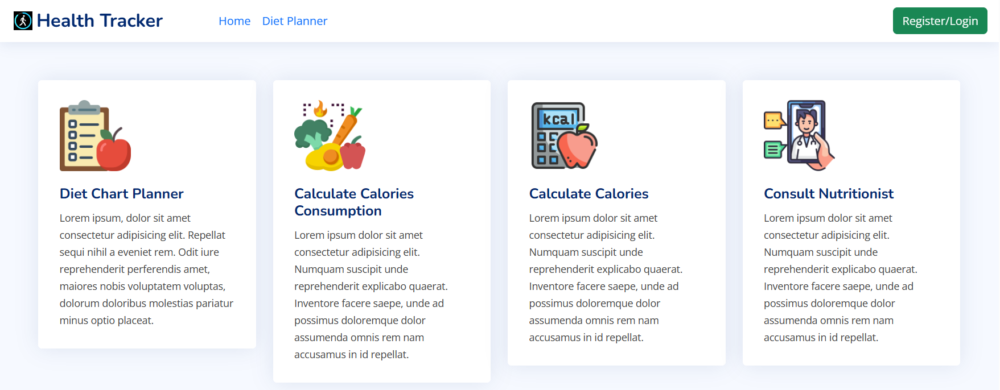
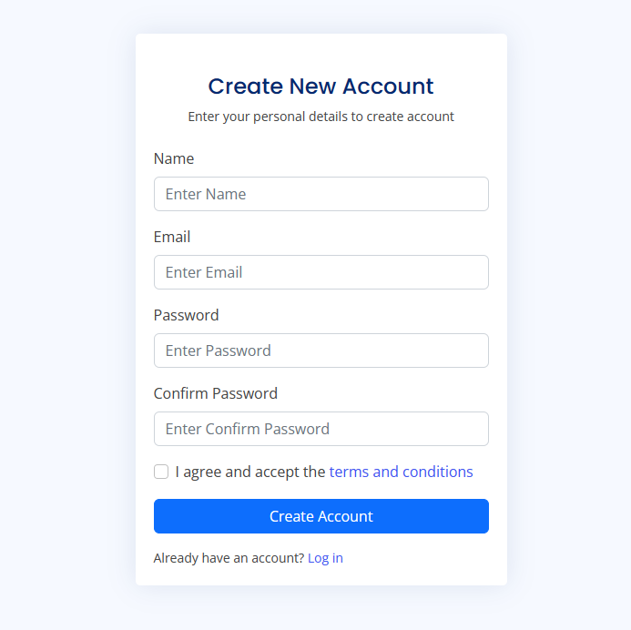
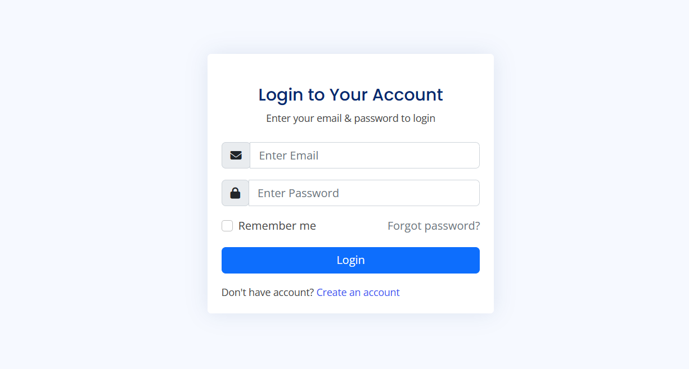
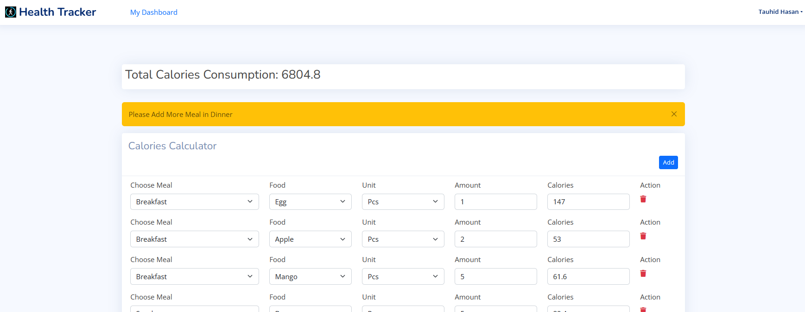

# Health Tracker

The purpose of an AI-Based diet chart planner software project is to develop a
system that can help individuals create personalized and healthy diet plans based on their
individual requirements, such as their age, gender, weight, height, physical activity levels, and
dietary preferences. The software uses artificial intelligence algorithms to analyze the user's data
and provide them with customized recommendations for daily caloric intake and macronutrient
distribution.
The software aims to simplify the process of meal planning and make it more efficient, accurate,
and convenient for users. By using AI, the software can provide users with personalized
recommendations that are tailored to their specific needs, taking into account their individual
lifestyle and health goals. The software can also help users track their progress and adjust their
diet plans accordingly.
Overall, the purpose of the AI-Based diet chart planner software project is to provide users with a
user-friendly and effective tool to help them improve their health and wellbeing by making
healthier and more informed dietary choices

The software should be designed to meet the needs of users who want to
create personalized and healthy diet plans. The software should be able to gather information
about the user's age, gender, weight, height, physical activity levels, and dietary preferences to
generate personalized recommendations.
The software should be designed to use artificial intelligence algorithms to analyze user data and
provide customized recommendations. The AI algorithms should be able to consider various
factors, such as the user's metabolic rate and nutrient requirements, to provide accurate and
relevant recommendations.
The software should have a user-friendly interface that is easy to navigate and understand. The
user interface should be designed to allow users to input their data and receive personalized
recommendations quickly and easily.
The software should have a database that stores user data and tracks their progress over time. The
database should be designed to be secure and protect user data from unauthorized access.
The software should have the ability to track and monitor user progress over time. This could
include features such as weight tracking, food logging, and exercise tracking.
The software could be designed to integrate with other health and fitness apps or devices, such as
fitness trackers or smart scales, to provide a more comprehensive view of the user's health and
wellbeing.
{ align=center }
## Authentication
To use our application user have to sign in to out application Entering Name, Email and Password.

{ align=center }

After successful signup user can login using email and password.
{ align=center }

## Required Calories Calculation
User can find their required calories entering their Gender, age, height, weight, activity level etc.
{ align=center }

## Calories Consumption
The diet chart software should allow users to track their daily calorie

intake by entering the food they consume into the software. The software should have a pre-
loaded food database that contains calorie information for various foods. Users should be able to

add their own foods and calorie information as well.
{ align=center }

## Function Requirements
1. User Registration: The diet chart software should allow users to register an account and
create a profile, including their age, gender, weight, height, and activity level.
2. Calorie Tracking: The diet chart software should allow users to track their daily calorie
intake by entering the food they consume into the software. The software should have a pre-
loaded food database that contains calorie information for various foods. Users should be able to
add their own foods and calorie information as well.

3. Diet Plan Creation: The diet chart software should allow users to create their own
personalized diet plans based on their weight loss or weight gain goals. The software should
provide recommendations on calorie intake based on the user's profile information and activity
level. There will an AI based automated Diet chart planer as well a paid version where user can
get consultancy of an expert Nutritionist

4. Meal Scheduling: The diet chart software should allow users to schedule their meals for the
day or week. Users should be able to view their scheduled meals in a calendar format.

5. Progress Tracking: The diet chart software should allow users to track their progress over
time, including weight loss or weight gain and changes in their body measurements.

6. Reminders and Notifications: The diet chart software should provide users with reminders
and notifications to help them stay on track with their diet plan. Users should be able to set
reminders for meal times, water intake, and exercise. There will be a Mobile app which will send
this push notification.

## Non-Functional Requirements
1. Performance: The diet chart software should be able to handle a large number of users and
be able to handle a large amount of data.
2. Security: The diet chart software should ensure that user data is secure and protected from
unauthorized access.
3. User Interface: The diet chart software should have a user-friendly interface that is easy to
navigate and understand.
4. Compatibility: The diet chart software should be compatible with different devices and
operating systems.
5. Scalability: The diet chart software should be designed to be easily scalable to accommodate
future growth and changes.

## System Architecture
Frontend Framework: VueJS, HTML, CSS, JavaScript
Backend Framework: Laravel
Datebase: MySQL, Firebase
Mobile App: Flutter & Dart

## Conclusion

   The development of an AI-based diet chart planner software requires a comprehensive
understanding of the requirements to ensure that the software meets the needs of the users. The
functional and non-functional requirements outlined in this SRS document will guide the
development process and ensure that the software is of high quality, secure, and user-friendly